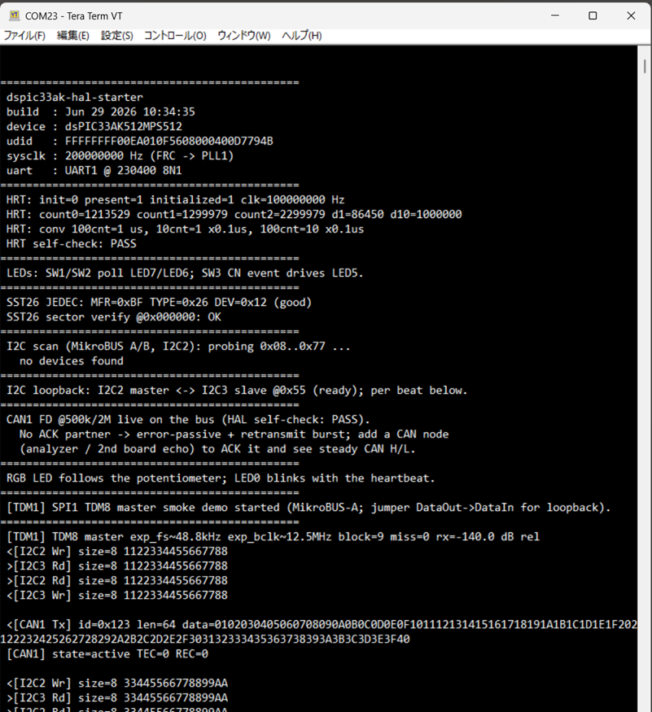
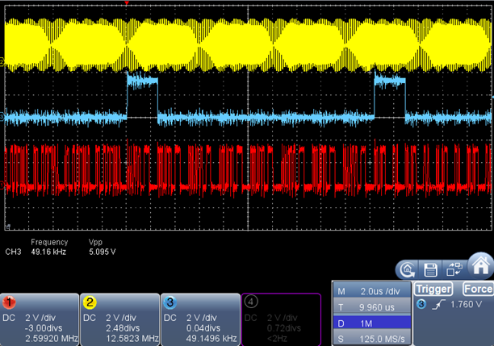
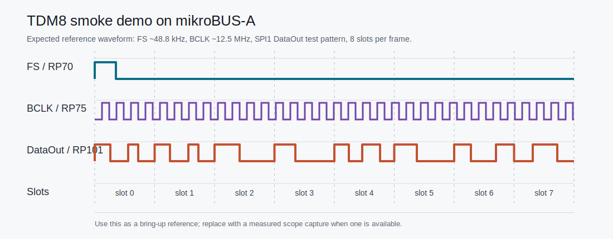

# dspic33ak-hal-starter

A ready-to-run MPLAB X starter project for the **dsPIC33AK512MPS512**.

Flash this project, open a serial terminal, and you should immediately see the
board bring-up log: clock setup, Timer1-based millisecond timing, Timer2
high-resolution counter self-check, UART
`printf()`, SPI flash verification, I2C scan, and then an alternating
I2C-loopback / CAN FD bus demo with RGB LED control and heartbeat output.



Captured from a live session using Tera Term. The output shows the complete
startup sequence: boot banner (including UDID), HRT self-check, SST26 verify,
I2C scan, I2C loopback, CAN1 FD with an ACK partner (`state=active`), and the
TDM8 smoke demo running on MikroBUS-A — all running together. On a single board
with no CAN partner, the CAN1 controller instead goes `error-passive` and
retransmits (a burst you can see on a scope/CAN analyzer).



Oscilloscope capture of the MikroBUS-A SPI pins with the TDM8 smoke demo
running: BCLK (~12.5 MHz, yellow), frame sync FS (~49 kHz, blue), and DataOut
carrying the eight-slot TDM8 pattern (red). This is the raw signal that appears
on the MikroBUS-A header when the demo is active; no codec is required. The FS
period (~20 µs) spans most of the 2 µs/div window, and each FS pulse frames the
8 × 32-bit data slots that follow it on DataOut.

## Required hardware

This project targets the following Microchip hardware - just two parts:

* **[EV74H48A](https://www.microchip.com/en-us/development-tool/EV74H48A)** -
  Curiosity Platform Development Board. It already carries an **on-board PKOB4**
  programmer/debugger and a USB connector, so a single USB cable handles both
  programming and the UART console - no separate programmer or adapter needed.
* **[EV80L65A](https://www.microchip.com/en-us/development-tool/EV80L65A)** -
  dsPIC33AK512MPS512 DIM, which plugs into the Curiosity board.

Plus a USB cable. No external hardware is required for the basic bring-up sequence.

The SST26 SPI flash, RGB LED, and potentiometer used by the demo are on the
Curiosity motherboard. The I2C scan also runs on a bare bus; if an I2C device is
connected, its ACK address is printed.

For the I2C master/slave loopback demo, I2C2 and I2C3 are used as a shared-bus
loopback on the starter board setup.

The starter application target is intentionally board- and device-specific:
EV74H48A + EV80L65A with a dsPIC33AK512MPS512 DIM. Some vendored HAL candidate
folders also contain dsPIC33AK512 / dsPIC33AK128 silicon facts so the HAL code
can remain reusable, but the starter board path shown here is the AK512 setup.

## What runs after programming?

After programming the board, open a serial terminal at **230400 8N1**.

The firmware demonstrates:

1. **Clock bring-up**
   FRC -> PLL1, SYSCLK = 200 MHz

2. **Timer HAL self-check**
   A Timer1-based 1 ms monotonic time base drives heartbeat timing and the
   timeout callbacks used by the I2C and CAN HALs. The application owns the
   `_T1Interrupt()` vector and forwards it to the Timer HAL handler. The
   starter uses the Timer HAL's public default IRQ-priority macro for this tick.
   Timer2 is also initialized as a free-running high-resolution counter and
   checked after the boot banner.

3. **UART console output**
   `printf()` through UART1 at 230400 8N1

4. **SPI flash access**
   Reads the SST26 JEDEC ID and verifies sector erase/write/read-back

5. **I2C bus scan**
   Probes 7-bit I2C addresses and prints devices that ACK

6. **I2C loopback**
   Runs an I2C2 master <-> I2C3 slave round-trip test

7. **CAN FD on the bus**
   A quick internal-loopback HAL self-check, then CAN1 transmits a CAN FD frame
   on the real bus each beat (NORMAL FD, 500k/2M). A lone board has no ACK
   partner, so it goes error-passive and retransmits — a visible burst on
   CANH/CANL — and the TX queue fills (`queue full / timeout`); connect a CAN
   node/analyzer (or a 2nd board in echo config) to ACK it and see steady CAN
   traffic. A dedicated two-board bus test is also available at build time (see
   `CAN_BUS_TEST` in `main.c`)

8. **GPIO / ADC / PWM demo**
   LEDs, switches, potentiometer input, RGB LED output, and heartbeat blinking

9. **SPI1 TDM8 smoke demo (codec-less, MikroBUS-A)** — default ON
   SPI1 runs as a self-clocked framed-mode (TDM8) master on MikroBUS-A
   (FS=RP70, BCLK=RP75, DataOut=RP101, DataIn=RP106), driving all 8 slots with a
   ~800 Hz-class sine, so a scope on DataOut shows a TDM8 frame (BCLK ~12.5 MHz,
   FS ~48.8 kHz — these are expected design values, not measurements). Jumper
   DataOut->DataIn to read the RX level near `0 dB rel`; with no jumper it floors near
   `-140 dB rel`. The stream runs on DMA/ISR and prints one status line every ~5 s:
   `[TDM1] TDM8 master exp_fs~48.8kHz exp_bclk~12.5MHz block=... miss=0 rx=... dB rel`.
   **This demo holds the MikroBUS-A SPI pins** — to use a real SPI Click board there, set
   `HAL_STARTER_ENABLE_TDM_SMOKE_DEMO 0` in `src/app/app_config.h`. A start failure is
   reported but does not stop the other demos. (The MikroBUS-A I2C SDA/SCL pins are
   different and are unaffected either way.)

### TDM8 smoke demo on mikroBUS-A

The starter firmware enables the TDM smoke demo by default. When the board is
running, the mikroBUS-A SPI pins output a TDM8-style framed serial waveform.
This is intended as a quick oscilloscope-visible bring-up check and a showcase
that the dsPIC33AK SPI framed-mode path can generate TDM-style audio timing
without a codec attached.



The snapshot above is an expected waveform reference for the default
configuration: FS around 48.8 kHz, BCLK around 12.5 MHz, 8 slots per frame, and
SPI1 DataOut carrying a test tone pattern. For a loopback check, jumper
DataOut -> DataIn and watch the `[TDM1]` status line move toward `0 dB rel`.

To use mikroBUS-A as a normal SPI Click interface, set
`HAL_STARTER_ENABLE_TDM_SMOKE_DEMO` to `0` in `src/app/app_config.h`. That frees
the mikroBUS-A SPI pins; the I2C pins on the same mikroBUS header are separate
and remain usable either way.

In short: this is a known-good hardware starter project for checking that the
board, toolchain, programmer, UART console, and basic HAL drivers are working
together.

This pairs with the standalone HALs:

- [dspic33ak-gpio-hal](https://github.com/sulaolab/dspic33ak-gpio-hal)
- [dspic33ak-uart-hal](https://github.com/sulaolab/dspic33ak-uart-hal)
- [dspic33ak-spi-hal](https://github.com/sulaolab/dspic33ak-spi-hal)
- [dspic33ak-i2c-hal](https://github.com/sulaolab/dspic33ak-i2c-hal)
- [dspic33ak-can-hal](https://github.com/sulaolab/dspic33ak-can-hal)
- [dspic33ak-timer-hal](https://github.com/sulaolab/dspic33ak-timer-hal)
- [dspic33ak-spi-i2s-tdm-hal](https://github.com/sulaolab/dspic33ak-spi-i2s-tdm-hal)

This starter also currently vendors integration HAL folders such as `hal_dma`
and the `hal_gpio_event` change-notification layer inside `hal_gpio`. The
starter's active HAL surface therefore includes GPIO/PPS/CN events, UART, SPI,
I2C, CAN FD, Timer, DMA, and SPI framed-mode I2S/TDM.

The reusable HAL implementations are maintained in the standalone repositories
above. This starter vendors validated snapshots under matching `src/hal_xxx/`
directories so the complete project builds without external source dependencies.
Starter-only glue intentionally stays outside those HAL folders: board pin/PPS
wiring lives in `src/board.*` and `src/board_pins.h`, board component helpers
live in `src/board_components/`, and the `printf()` UART retarget lives in
`src/console/`.

This repository serves as the hardware integration and regression-validation
project for the HAL set: clock, GPIO, UART, SPI, I2C, CAN FD, and Timer are
exercised together on the target board.

## Toolchain

* MPLAB X IDE (v6.30 or compatible)
* XC-DSC compiler v3.31.01
* DFP: Microchip dsPIC33AK-MP DFP 1.3.185

This repository does **not** include Microchip DFP/header files; install the DFP
through MPLAB X.

## Build & run

### MPLAB X IDE

1. Open `firmware.X` in MPLAB X (this regenerates the per-machine makefiles).
2. Build (single configuration `dsPIC33AK512`, device dsPIC33AK512MPS512).
3. Program to the board with the on-board PKOB4.
4. Open a serial terminal on the board's USB-serial port at **230400 8N1**.

Only `firmware.X/nbproject/{configurations,project}.xml` and the top-level
`firmware.X/Makefile` are tracked; build output and the per-machine generated
makefiles are git-ignored and recreated by MPLAB X.

When a change adds, removes, renames, or moves `.c` files or source folders,
open the project in MPLAB X or otherwise regenerate the per-configuration
makefiles before building. `configurations.xml` is the tracked source of truth;
`nbproject/Makefile-*.mk` files are local generated artifacts.

### Command-line (PowerShell)

The `buildtools/` scripts provide a command-line build and flash workflow without
opening MPLAB X. MPLAB X and XC-DSC must be installed. The scripts auto-detect the MPLAB X
make and project-generator tools; the generated project makefiles invoke XC-DSC.

```powershell
# Incremental build (auto-detects MPLAB X version and firmware.X project)
.\buildtools\build.ps1

# Full clean-build: regenerate makefiles, clean outputs, rebuild
.\buildtools\build.ps1 -Full

# Clean outputs only
.\buildtools\build.ps1 -Clean

# Regenerate MPLAB X makefiles only (use after adding/moving source files)
.\buildtools\build.ps1 -Generate

# Flash the built HEX to the connected board (auto-detects PKOB4 serial)
.\buildtools\flashauto.ps1

# Reset the board without flashing
.\buildtools\flashauto.ps1 -Reset

# Clean Boost Java state before the reset step, then flash + reset
.\buildtools\flashauto.ps1 -CleanJava

# List connected PKOB4 serials
.\buildtools\flashauto.ps1 -List

# Specify target serial and device explicitly
.\buildtools\flashauto.ps1 -Serial 'YOUR_PKOB4_SERIAL' -Device dsPIC33AK512MPS512
```

`flashauto.ps1` uses the `flash_pkob4.exe` and `reset_pkob4.exe` tools vendored
under `./_flash_reset_tools`, so a fresh clone can flash and reset without a
separate tool install. To use a different copy, set `FLASH_RESET_TOOLS` or pass
`-ToolsDir`; the legacy sibling `../_flash_reset_tools` location is also checked
as a fallback. The script auto-detects the serial number if only one PKOB4 is
connected; pass `-Serial <PKOB4_SERIAL>` when multiple boards are attached.

## Expected serial output

```
==============================================
 dspic33ak-hal-starter
 build  : ...
 device : dsPIC33AK512MPS512
 udid   : ...
 sysclk : 200000000 Hz (FRC -> PLL1)
 uart   : UART1 @ 230400 8N1
==============================================
 HRT: init=0 present=1 initialized=1 clk=100000000 Hz
 HRT: count0=... count1=... count2=... d1=... d10=...
 HRT: conv 100cnt=1 us, 10cnt=1 x0.1us, 100cnt=10 x0.1us
 HRT self-check: PASS
==============================================
 LEDs: SW1/SW2 poll LED7/LED6; SW3 CN event drives LED5.
==============================================
 SST26 JEDEC: MFR=0xBF TYPE=0x26 DEV=0x12 (good)
 SST26 sector verify @0x000000: OK
==============================================
 I2C scan (MikroBUS A/B, I2C2): probing 0x08..0x77 ...
   no devices found
==============================================
 I2C loopback: I2C2 master <-> I2C3 slave @0x55 (ready); per beat below.
==============================================
 CAN1 FD @500k/2M live on the bus (HAL self-check: PASS).
   No ACK partner -> error-passive + retransmit burst; add a CAN node
   (analyzer / 2nd board echo) to ACK it and see steady CAN H/L.
==============================================
 RGB LED follows the potentiometer; LED0 blinks with the heartbeat.
==============================================
 [TDM1] SPI1 TDM8 master smoke demo started (MikroBUS-A; jumper DataOut->DataIn for loopback).

 [TDM1] TDM8 master exp_fs~48.8kHz exp_bclk~12.5MHz block=... miss=0 rx=... dB rel
 <[I2C2 Wr] size=8 1122334455667788
 >[I2C3 Rd] size=8 1122334455667788
 >[I2C2 Rd] size=8 1122334455667788
 <[I2C3 Wr] size=8 1122334455667788

 <[CAN1 Tx] id=0x123 len=64 data=05060708...4344
 [CAN1] state=active TEC=0 REC=0

 <[I2C2 Wr] size=8 ...
 ...
```

The two peripheral demos alternate once per second (CAN FD on one beat, the I2C
master/slave round trip on the next), separated by a blank line. The TDM smoke
demo runs in the background and prints one status line every ~5 s.

(I2C scan results depend on what is attached; the loopback slave itself runs at
`0x55`. Turning the potentiometer sweeps the RGB LED. With no CAN ACK partner
the CAN1 controller is `error-passive` and retransmits — the TX queue fills
(`queue full / timeout`); connect another CAN node to ACK it and it returns to
`state=active`.)

## Layout

```
firmware.X/             MPLAB X project (single config, dsPIC33AK512MPS512)
buildtools/             command-line build, clean, flash, and reset scripts
.vscode/clean.ps1       robust MPLAB X output cleanup helper (used by build.ps1)
src/
  main.c                boot sequence + main loop
  board.c/.h            board bring-up: GPIO electrical config + PPS routing
  board_pins.h          board pin names (RP numbers for PPS pins; packed pin
                        for non-PPS GPIO-only pins)
  clock/                dspic33ak_clock (PLL1 + CLKGEN routing)
  board_components/     board-specific component helpers built on HALs
                        or minimal device-level code
                        (LED/SW, RGB/POT, SST26 SPI-NOR)
  console/              starter glue: printf write() retarget to UART1
  hal_gpio/             vendored GPIO+PPS HAL family:
                        dspic33ak_gpio.*    GPIO electrical attributes
                        dspic33ak_pps.*     peripheral signal routing (PPS)
                        dspic33ak_gpio_event.*  CN change-notification events
  hal_uart/             vendored UART HAL
  hal_spi/              vendored SPI HAL (blocking master; SST26 flash on SPI4)
  hal_i2c/              vendored I2C HAL
  hal_can/              vendored CAN FD HAL: dspic33ak_canfd_* (node + optional ISR layer)
  hal_timer/            vendored Timer HAL
                        (Timer1 1 ms tick, default IRQ priority macro,
                        and Timer2 high-resolution counter)
  hal_udid/             local UDID helper used by the boot banner
  hal_dma/              vendored DMA HAL (low-level channel config; used by the TDM HAL)
  hal_spi_i2s_tdm/      vendored SPI framed-mode I2S/TDM transport HAL
                        (DMA ping-pong + per-instance block callback; board-free
                        via a port hook). See its own README.md.
  dspic33ak_spi_i2s_tdm_conf.h  project-supplied (self-contained) config for the
                        TDM HAL: single SPI1 TDM8 stream, DMA0/1. It is kept
                        near the top of src/ so it is easy to find in MPLAB X.
  app/                  bus validation samples: i2c_scan, i2c_loopback,
                        can_loopback, can_bus_test (two-board); app_config.h
                        (demo toggles); tdm_smoke (SPI1 TDM8 smoke demo)
docs/
  images/
    serial-console.png   live two-board CAN FD + I2C session screenshot
    tdm8-smoke-waveform.svg
                         expected TDM8 smoke-demo waveform reference
  source_layout.md       source-tree ownership and vendored-HAL layout notes
  hal_gpio_event_design.md
                         GPIO CN event usage and current limitations
  hal_udid.md           UDID helper notes
  touch-addon.md        optional capacitive-touch add-on (QTM; not bundled)
```

Design split: **GPIO / UART / SPI / I2C / CAN FD / Timer are the HALs**.
Validated snapshots are vendored into matching `src/hal_xxx/` folders for
hardware integration and regression testing. Clock setup, board pin/PPS wiring,
board-specific component helpers, console retargeting, and the bus validation demos
remain starter-specific code, kept deliberately small and hand-written. See
`docs/source_layout.md` for the ownership rules.

The standalone Timer HAL is maintained at
[dspic33ak-timer-hal](https://github.com/sulaolab/dspic33ak-timer-hal). The
copy under `src/hal_timer/` is the version integrated and validated by this
starter project.

**GPIO / PPS architecture:** the board layer owns the board-specific pin
assignments (which signal goes to which RP on this PCB). GPIO electrical
configuration (direction, pull, analog, open-drain) is handled by
`dspic33ak_gpio.*`; generic PPS signal routing is handled by the companion
`dspic33ak_pps.*` layer. Both are in `src/hal_gpio/`. The board layer
(`board.c` / `board_pins.h`) wires them together, using the RP number as the
single identifier for both GPIO config and PPS routing on PPS-capable pins.

## Capacitive touch

The Curiosity board's touch pads are supported via Microchip's QTM library, which
is proprietary and tool-generated, so it is **not** part of this MIT-0 starter.
See [docs/touch-addon.md](docs/touch-addon.md) for how to add it yourself.

## License

MIT No Attribution License (MIT-0). See [LICENSE](LICENSE).

Attribution is appreciated but not required.
